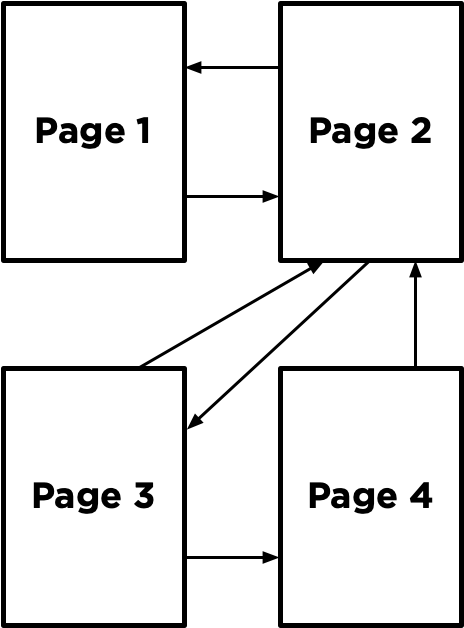
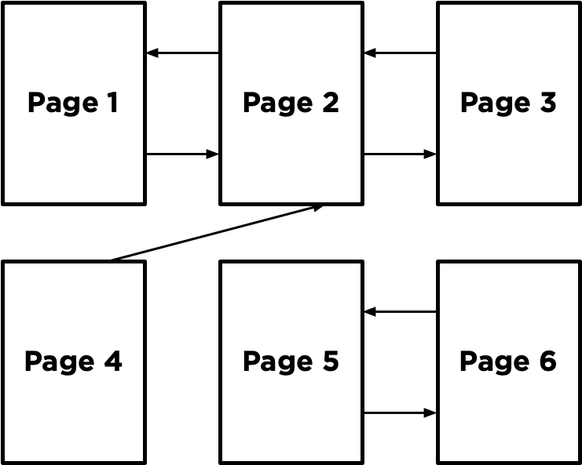
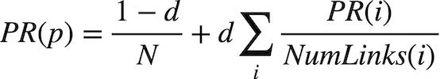
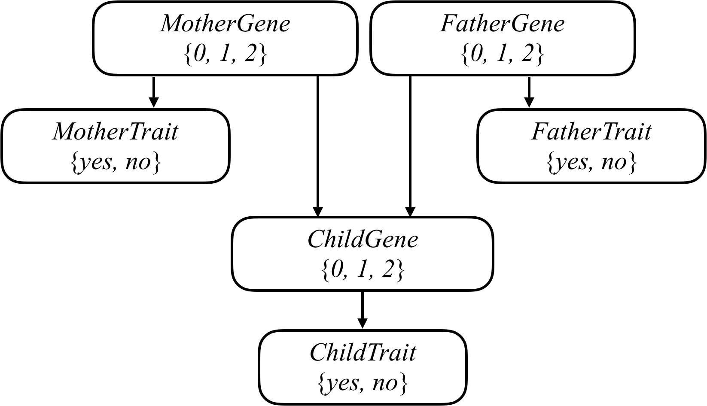
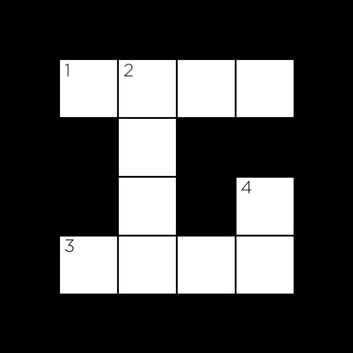

<h3>1. Degrees</h3>
```
$ python degrees.py large
Loading data...
Data loaded.
Name: Emma Watson
Name: Jennifer Lawrence
3 degrees of separation.
1: Emma Watson and Brendan Gleeson starred in Harry Potter and the Order of the Phoenix
2: Brendan Gleeson and Michael Fassbender starred in Trespass Against Us
3: Michael Fassbender and Jennifer Lawrence starred in X-Men: First Class
```
<h3>Background</h3>
According to the Six Degrees of Kevin Bacon game, anyone in the Hollywood film industry can be connected to Kevin Bacon within six steps, where each step consists of finding a film that two actors both starred in.

In this problem, we’re interested in finding the shortest path between any two actors by choosing a sequence of movies that connects them. For example, the shortest path between Jennifer Lawrence and Tom Hanks is 2: Jennifer Lawrence is connected to Kevin Bacon by both starring in “X-Men: First Class,” and Kevin Bacon is connected to Tom Hanks by both starring in “Apollo 13.”

We can frame this as a search problem: our states are people. Our actions are movies, which take us from one actor to another (it’s true that a movie could take us to multiple different actors, but that’s okay for this problem). Our initial state and goal state are defined by the two people we’re trying to connect. By using breadth-first search, we can find the shortest path from one actor to another.

<h3>2. Tic-Tac-Toe</h3>

<h3>3. Knights</h3>
```
python puzzle.py
```

<h3>Background</h3>
In 1978, logician Raymond Smullyan published “What is the name of this book?”, a book of logical puzzles. Among the puzzles in the book were a class of puzzles that Smullyan called “Knights and Knaves” puzzles.

In a Knights and Knaves puzzle, the following information is given: Each character is either a knight or a knave. A knight will always tell the truth: if knight states a sentence, then that sentence is true. Conversely, a knave will always lie: if a knave states a sentence, then that sentence is false.

The objective of the puzzle is, given a set of sentences spoken by each of the characters, determine, for each character, whether that character is a knight or a knave.

For example, consider a simple puzzle with just a single character named A. A says “I am both a knight and a knave.”

Logically, we might reason that if A were a knight, then that sentence would have to be true. But we know that the sentence cannot possibly be true, because A cannot be both a knight and a knave – we know that each character is either a knight or a knave, but not both. So, we could conclude, A must be a knave.

That puzzle was on the simpler side. With more characters and more sentences, the puzzles can get trickier! Your task in this problem is to determine how to represent these puzzles using propositional logic, such that an AI running a model-checking algorithm could solve these puzzles for us.


<h3>4. Minesweeper</h3>
```
python minesweeper/runner.py
```
<h3>Background</h3>
<h4>Minesweeper</h4>
Minesweeper is a puzzle game that consists of a grid of cells, where some of the cells contain hidden “mines.” Clicking on a cell that contains a mine detonates the mine, and causes the user to lose the game. Clicking on a “safe” cell (i.e., a cell that does not contain a mine) reveals a number that indicates how many neighboring cells – where a neighbor is a cell that is one square to the left, right, up, down, or diagonal from the given cell – contain a mine.

In this 3x3 Minesweeper game, for example, the three 1 values indicate that each of those cells has one neighboring cell that is a mine. The four 0 values indicate that each of those cells has no neighboring mine.

Sample safe cell numbers

Given this information, a logical player could conclude that there must be a mine in the lower-right cell and that there is no mine in the upper-left cell, for only in that case would the numerical labels on each of the other cells be accurate.

The goal of the game is to flag (i.e., identify) each of the mines. In many implementations of the game, including the one in this project, the player can flag a mine by right-clicking on a cell (or two-finger clicking, depending on the computer).
<h4>Propositional Logic</h4>
Your goal in this project will be to build an AI that can play Minesweeper. Recall that knowledge-based agents make decisions by considering their knowledge base, and making inferences based on that knowledge.

One way we could represent an AI’s knowledge about a Minesweeper game is by making each cell a propositional variable that is true if the cell contains a mine, and false otherwise.

What information does the AI have access to? Well, the AI would know every time a safe cell is clicked on and would get to see the number for that cell. Consider the following Minesweeper board, where the middle cell has been revealed, and the other cells have been labeled with an identifying letter for the sake of discussion.

What information do we have now? It appears we now know that one of the eight neighboring cells is a mine. Therefore, we could write a logical expression like the below to indicate that one of the neighboring cells is a mine.

```
Or(A, B, C, D, E, F, G, H)
```
But we actually know more than what this expression says. The above logical sentence expresses the idea that at least one of those eight variables is true. But we can make a stronger statement than that: we know that exactly one of the eight variables is true. This gives us a propositional logic sentence like the below.

```
Or(
    And(A, Not(B), Not(C), Not(D), Not(E), Not(F), Not(G), Not(H)),
    And(Not(A), B, Not(C), Not(D), Not(E), Not(F), Not(G), Not(H)),
    And(Not(A), Not(B), C, Not(D), Not(E), Not(F), Not(G), Not(H)),
    And(Not(A), Not(B), Not(C), D, Not(E), Not(F), Not(G), Not(H)),
    And(Not(A), Not(B), Not(C), Not(D), E, Not(F), Not(G), Not(H)),
    And(Not(A), Not(B), Not(C), Not(D), Not(E), F, Not(G), Not(H)),
    And(Not(A), Not(B), Not(C), Not(D), Not(E), Not(F), G, Not(H)),
    And(Not(A), Not(B), Not(C), Not(D), Not(E), Not(F), Not(G), H)
)
```
That’s quite a complicated expression! And that’s just to express what it means for a cell to have a 1 in it. If a cell has a 2 or 3 or some other value, the expression could be even longer.

Trying to perform model checking on this type of problem, too, would quickly become intractable: on an 8x8 grid, the size Microsoft uses for its Beginner level, we’d have 64 variables, and therefore 2^64 possible models to check – far too many for a computer to compute in any reasonable amount of time. We need a better representation of knowledge for this problem.

<h4>Knowledge Representation</h4>
Instead, we’ll represent each sentence of our AI’s knowledge like the below.
```
{A, B, C, D, E, F, G, H} = 1
```
Every logical sentence in this representation has two parts: a set of cells on the board that are involved in the sentence, and a number count, representing the count of how many of those cells are mines. The above logical sentence says that out of cells A, B, C, D, E, F, G, and H, exactly 1 of them is a mine.

Why is this a useful representation? In part, it lends itself well to certain types of inference. Consider the game below.

Minesweeper game where cells can be inferred as safe

Using the knowledge from the lower-left number, we could construct the sentence {D, E, G} = 0 to mean that out of cells D, E, and G, exactly 0 of them are mines. Intuitively, we can infer from that sentence that all of the cells must be safe. By extension, any time we have a sentence whose count is 0, we know that all of that sentence’s cells must be safe.

Similarly, consider the game below.

Minesweeper game where cells can be inferred as mines

Our AI would construct the sentence {E, F, H} = 3. Intuitively, we can infer that all of E, F, and H are mines. More generally, any time the number of cells is equal to the count, we know that all of that sentence’s cells must be mines.

In general, we’ll only want our sentences to be about cells that are not yet known to be either safe or mines. This means that, once we know whether a cell is a mine or not, we can update our sentences to simplify them and potentially draw new conclusions.

For example, if our AI knew the sentence {A, B, C} = 2, we don’t yet have enough information to conclude anything. But if we were told that C were safe, we could remove C from the sentence altogether, leaving us with the sentence {A, B} = 2 (which, incidentally, does let us draw some new conclusions.)

Likewise, if our AI knew the sentence {A, B, C} = 2, and we were told that C is a mine, we could remove C from the sentence and decrease the value of count (since C was a mine that contributed to that count), giving us the sentence {A, B} = 1. This is logical: if two out of A, B, and C are mines, and we know that C is a mine, then it must be the case that out of A and B, exactly one of them is a mine.

If we’re being even more clever, there’s one final type of inference we can do.

Minesweeper game where inference by subsets is possible

Consider just the two sentences our AI would know based on the top middle cell and the bottom middle cell. From the top middle cell, we have {A, B, C} = 1. From the bottom middle cell, we have {A, B, C, D, E} = 2. Logically, we could then infer a new piece of knowledge, that {D, E} = 1. After all, if two of A, B, C, D, and E are mines, and only one of A, B, and C are mines, then it stands to reason that exactly one of D and E must be the other mine.

More generally, any time we have two sentences set1 = count1 and set2 = count2 where set1 is a subset of set2, then we can construct the new sentence set2 - set1 = count2 - count1. Consider the example above to ensure you understand why that’s true.

So using this method of representing knowledge, we can write an AI agent that can gather knowledge about the Minesweeper board, and hopefully select cells it knows to be safe!
<h3>5. PageRank</h3>
```
$ python pagerank/pagerank.py corpus0
PageRank Results from Sampling (n = 10000)
  1.html: 0.2223
  2.html: 0.4303
  3.html: 0.2145
  4.html: 0.1329
PageRank Results from Iteration
  1.html: 0.2202
  2.html: 0.4289
  3.html: 0.2202
  4.html: 0.1307
```
<h3>Background</h3>
When search engines like Google display search results, they do so by placing more “important” and higher-quality pages higher in the search results than less important pages. But how does the search engine know which pages are more important than other pages?

One heuristic might be that an “important” page is one that many other pages link to, since it’s reasonable to imagine that more sites will link to a higher-quality webpage than a lower-quality webpage. We could therefore imagine a system where each page is given a rank according to the number of incoming links it has from other pages, and higher ranks would signal higher importance.

But this definition isn’t perfect: if someone wants to make their page seem more important, then under this system, they could simply create many other pages that link to their desired page to artificially inflate its rank.

For that reason, the PageRank algorithm was created by Google’s co-founders (including Larry Page, for whom the algorithm was named). In PageRank’s algorithm, a website is more important if it is linked to by other important websites, and links from less important websites have their links weighted less. This definition seems a bit circular, but it turns out that there are multiple strategies for calculating these rankings.
<h4>Random Surfer Model</h4>
One way to think about PageRank is with the random surfer model, which considers the behavior of a hypothetical surfer on the internet who clicks on links at random. Consider the corpus of web pages below, where an arrow between two pages indicates a link from one page to another.

The random surfer model imagines a surfer who starts with a web page at random, and then randomly chooses links to follow. If the surfer is on Page 2, for example, they would randomly choose between Page 1 and Page 3 to visit next (duplicate links on the same page are treated as a single link, and links from a page to itself are ignored as well). If they chose Page 3, the surfer would then randomly choose between Page 2 and Page 4 to visit next.

A page’s PageRank, then, can be described as the probability that a random surfer is on that page at any given time. After all, if there are more links to a particular page, then it’s more likely that a random surfer will end up on that page. Moreover, a link from a more important site is more likely to be clicked on than a link from a less important site that fewer pages link to, so this model handles weighting links by their importance as well.

One way to interpret this model is as a Markov Chain, where each page represents a state, and each page has a transition model that chooses among its links at random. At each time step, the state switches to one of the pages linked to by the current state.

By sampling states randomly from the Markov Chain, we can get an estimate for each page’s PageRank. We can start by choosing a page at random, then keep following links at random, keeping track of how many times we’ve visited each page. After we’ve gathered all of our samples (based on a number we choose in advance), the proportion of the time we were on each page might be an estimate for that page’s rank.

However, this definition of PageRank proves slightly problematic, if we consider a network of pages like the below.

Imagine we randomly started by sampling Page 5. We’d then have no choice but to go to Page 6, and then no choice but to go to Page 5 after that, and then Page 6 again, and so forth. We’d end up with an estimate of 0.5 for the PageRank for Pages 5 and 6, and an estimate of 0 for the PageRank of all the remaining pages, since we spent all our time on Pages 5 and 6 and never visited any of the other pages.

To ensure we can always get to somewhere else in the corpus of web pages, we’ll introduce to our model a damping factor d. With probability d (where d is usually set around 0.85), the random surfer will choose from one of the links on the current page at random. But otherwise (with probability 1 - d), the random surfer chooses one out of all of the pages in the corpus at random (including the one they are currently on).

Our random surfer now starts by choosing a page at random, and then, for each additional sample we’d like to generate, chooses a link from the current page at random with probability d, and chooses any page at random with probability 1 - d. If we keep track of how many times each page has shown up as a sample, we can treat the proportion of states that were on a given page as its PageRank.
<h4>Iterative Algorithm</h4>
We can also define a page’s PageRank using a recursive mathematical expression. Let PR(p) be the PageRank of a given page p: the probability that a random surfer ends up on that page. How do we define PR(p)? Well, we know there are two ways that a random surfer could end up on the page:

1. With probability 1 - d, the surfer chose a page at random and ended up on page p.
2. With probability d, the surfer followed a link from a page i to page p.
The first condition is fairly straightforward to express mathematically: it’s 1 - d divided by N, where N is the total number of pages across the entire corpus. This is because the 1 - d probability of choosing a page at random is split evenly among all N possible pages.

For the second condition, we need to consider each possible page i that links to page p. For each of those incoming pages, let NumLinks(i) be the number of links on page i. Each page i that links to p has its own PageRank, PR(i), representing the probability that we are on page i at any given time. And since from page i we travel to any of that page’s links with equal probability, we divide PR(i) by the number of links NumLinks(i) to get the probability that we were on page i and chose the link to page p.

This gives us the following definition for the PageRank for a page p.

In this formula, d is the damping factor, N is the total number of pages in the corpus, i ranges over all pages that link to page p, and NumLinks(i) is the number of links present on page i.

How would we go about calculating PageRank values for each page, then? We can do so via iteration: start by assuming the PageRank of every page is 1 / N (i.e., equally likely to be on any page). Then, use the above formula to calculate new PageRank values for each page, based on the previous PageRank values. If we keep repeating this process, calculating a new set of PageRank values for each page based on the previous set of PageRank values, eventually the PageRank values will converge (i.e., not change by more than a small threshold with each iteration).

In this project, you’ll implement both such approaches for calculating PageRank – calculating both by sampling pages from a Markov Chain random surfer and by iteratively applying the PageRank formula.
<h3>6. Heredity</h3>
```
$ python heredity/heredity.py heredity/data/family0.csv
Harry:
  Gene:
    2: 0.0092
    1: 0.4557
    0: 0.5351
  Trait:
    True: 0.2665
    False: 0.7335
James:
  Gene:
    2: 0.1976
    1: 0.5106
    0: 0.2918
  Trait:
    True: 1.0000
    False: 0.0000
Lily:
  Gene:
    2: 0.0036
    1: 0.0136
    0: 0.9827
  Trait:
    True: 0.0000
    False: 1.0000
```
<h3>Background</h3>
Mutated versions of the GJB2 gene are one of the leading causes of hearing impairment in newborns. Each person carries two versions of the gene, so each person has the potential to possess either 0, 1, or 2 copies of the hearing impairment version GJB2. Unless a person undergoes genetic testing, though, it’s not so easy to know how many copies of mutated GJB2 a person has. This is some “hidden state”: information that has an effect that we can observe (hearing impairment), but that we don’t necessarily directly know. After all, some people might have 1 or 2 copies of mutated GJB2 but not exhibit hearing impairment, while others might have no copies of mutated GJB2 yet still exhibit hearing impairment.

Every child inherits one copy of the GJB2 gene from each of their parents. If a parent has two copies of the mutated gene, then they will pass the mutated gene on to the child; if a parent has no copies of the mutated gene, then they will not pass the mutated gene on to the child; and if a parent has one copy of the mutated gene, then the gene is passed on to the child with probability 0.5. After a gene is passed on, though, it has some probability of undergoing additional mutation: changing from a version of the gene that causes hearing impairment to a version that doesn’t, or vice versa.

We can attempt to model all of these relationships by forming a Bayesian Network of all the relevant variables, as in the one below, which considers a family of two parents and a single child.


Each person in the family has a Gene random variable representing how many copies of a particular gene (e.g., the hearing impairment version of GJB2) a person has: a value that is 0, 1, or 2. Each person in the family also has a Trait random variable, which is yes or no depending on whether that person expresses a trait (e.g., hearing impairment) based on that gene. There’s an arrow from each person’s Gene variable to their Trait variable to encode the idea that a person’s genes affect the probability that they have a particular trait. Meanwhile, there’s also an arrow from both the mother and father’s Gene random variable to their child’s Gene random variable: the child’s genes are dependent on the genes of their parents.

Your task in this project is to use this model to make inferences about a population. Given information about people, who their parents are, and whether they have a particular observable trait (e.g. hearing loss) caused by a given gene, your AI will infer the probability distribution for each person’s genes, as well as the probability distribution for whether any person will exhibit the trait in question.


<h3>7. Crossword</h3>
```
$ python crossword/generate.py crossword/data/structure1.txt data/words1.txt output.png
██████████████
███████M████R█
█INTELLIGENCE█
█N█████N████S█
█F██LOGIC███O█
█E█████M████L█
█R███SEARCH█V█
███████X████E█
██████████████
```
<h3>Background</h3>
How might you go about generating a crossword puzzle? Given the structure of a crossword puzzle (i.e., which squares of the grid are meant to be filled in with a letter), and a list of words to use, the problem becomes one of choosing which words should go in each vertical or horizontal sequence of squares. We can model this sort of problem as a constraint satisfaction problem. Each sequence of squares is one variable, for which we need to decide on its value (which word in the domain of possible words will fill in that sequence). Consider the following crossword puzzle structure.


In this structure, we have four variables, representing the four words we need to fill into this crossword puzzle (each indicated by a number in the above image). Each variable is defined by four values: the row it begins on (its i value), the column it begins on (its j value), the direction of the word (either down or across), and the length of the word. Variable 1, for example, would be a variable represented by a row of 1 (assuming 0 indexed counting from the top), a column of 1 (also assuming 0 indexed counting from the left), a direction of across, and a length of 4.

As with many constraint satisfaction problems, these variables have both unary and binary constraints. The unary constraint on a variable is given by its length. For Variable 1, for instance, the value BYTE would satisfy the unary constraint, but the value BIT would not (it has the wrong number of letters). Any values that don’t satisfy a variable’s unary constraints can therefore be removed from the variable’s domain immediately.

The binary constraints on a variable are given by its overlap with neighboring variables. Variable 1 has a single neighbor: Variable 2. Variable 2 has two neighbors: Variable 1 and Variable 3. For each pair of neighboring variables, those variables share an overlap: a single square that is common to them both. We can represent that overlap as the character index in each variable’s word that must be the same character. For example, the overlap between Variable 1 and Variable 2 might be represented as the pair (1, 0), meaning that Variable 1’s character at index 1 necessarily must be the same as Variable 2’s character at index 0 (assuming 0-indexing, again). The overlap between Variable 2 and Variable 3 would therefore be represented as the pair (3, 1): character 3 of Variable 2’s value must be the same as character 1 of Variable 3’s value.

For this problem, we’ll add the additional constraint that all words must be different: the same word should not be repeated multiple times in the puzzle.

The challenge ahead, then, is write a program to find a satisfying assignment: a different word (from a given vocabulary list) for each variable such that all of the unary and binary constraints are met.

<h3>8. Shopping</h3>
<h3>Background</h3>
When users are shopping online, not all will end up purchasing something. Most visitors to an online shopping website, in fact, likely don’t end up going through with a purchase during that web browsing session. It might be useful, though, for a shopping website to be able to predict whether a user intends to make a purchase or not: perhaps displaying different content to the user, like showing the user a discount offer if the website believes the user isn’t planning to complete the purchase. How could a website determine a user’s purchasing intent? That’s where machine learning will come in.

Your task in this problem is to build a nearest-neighbor classifier to solve this problem. Given information about a user — how many pages they’ve visited, whether they’re shopping on a weekend, what web browser they’re using, etc. — your classifier will predict whether or not the user will make a purchase. Your classifier won’t be perfectly accurate — perfectly modeling human behavior is a task well beyond the scope of this class — but it should be better than guessing randomly. To train your classifier, we’ll provide you with some data from a shopping website from about 12,000 users sessions.

How do we measure the accuracy of a system like this? If we have a testing data set, we could run our classifier on the data, and compute what proportion of the time we correctly classify the user’s intent. This would give us a single accuracy percentage. But that number might be a little misleading. Imagine, for example, if about 15% of all users end up going through with a purchase. A classifier that always predicted that the user would not go through with a purchase, then, we would measure as being 85% accurate: the only users it classifies incorrectly are the 15% of users who do go through with a purchase. And while 85% accuracy sounds pretty good, that doesn’t seem like a very useful classifier.

Instead, we’ll measure two values: sensitivity (also known as the “true positive rate”) and specificity (also known as the “true negative rate”). Sensitivity refers to the proportion of positive examples that were correctly identified: in other words, the proportion of users who did go through with a purchase who were correctly identified. Specificity refers to the proportion of negative examples that were correctly identified: in this case, the proportion of users who did not go through with a purchase who were correctly identified. So our “always guess no” classifier from before would have perfect specificity (1.0) but no sensitivity (0.0). Our goal is to build a classifier that performs reasonably on both metrics.
<h3>8. Nim</h3>
```
$ python nim/play.py
Playing training game 1
Playing training game 2
Playing training game 3
...
Playing training game 9999
Playing training game 10000
Done training

Piles:
Pile 0: 1
Pile 1: 3
Pile 2: 5
Pile 3: 7

AI's Turn
AI chose to take 1 from pile 2.
```
<h3>Background</h3>
Recall that in the game Nim, we begin with some number of piles, each with some number of objects. Players take turns: on a player’s turn, the player removes any non-negative number of objects from any one non-empty pile. Whoever removes the last object loses.

There’s some simple strategy you might imagine for this game: if there’s only one pile and three objects left in it, and it’s your turn, your best bet is to remove two of those objects, leaving your opponent with the third and final object to remove. But if there are more piles, the strategy gets considerably more complicated. In this problem, we’ll build an AI to learn the strategy for this game through reinforcement learning. By playing against itself repeatedly and learning from experience, eventually our AI will learn which actions to take and which actions to avoid.

In particular, we’ll use Q-learning for this project. Recall that in Q-learning, we try to learn a reward value (a number) for every (state, action) pair. An action that loses the game will have a reward of -1, an action that results in the other player losing the game will have a reward of 1, and an action that results in the game continuing has an immediate reward of 0, but will also have some future reward.

How will we represent the states and actions inside of a Python program? A “state” of the Nim game is just the current size of all of the piles. A state, for example, might be [1, 1, 3, 5], representing the state with 1 object in pile 0, 1 object in pile 1, 3 objects in pile 2, and 5 objects in pile 3. An “action” in the Nim game will be a pair of integers (i, j), representing the action of taking j objects from pile i. So the action (3, 5) represents the action “from pile 3, take away 5 objects.” Applying that action to the state [1, 1, 3, 5] would result in the new state [1, 1, 3, 0] (the same state, but with pile 3 now empty).

Recall that the key formula for Q-learning is below. Every time we are in a state s and take an action a, we can update the Q-value Q(s, a) according to:
```
Q(s, a) <- Q(s, a) + alpha * (new value estimate - old value estimate)
```
In the above formula, alpha is the learning rate (how much we value new information compared to information we already have). The new value estimate represents the sum of the reward received for the current action and the estimate of all the future rewards that the player will receive. The old value estimate is just the existing value for Q(s, a). By applying this formula every time our AI takes a new action, over time our AI will start to learn which actions are better in any state.
<h3>9. Traffic</h3>
```
$ python traffic/traffic.py traffic/gtsrb
Epoch 1/10
500/500 [==============================] - 5s 9ms/step - loss: 3.7139 - accuracy: 0.1545
Epoch 2/10
500/500 [==============================] - 6s 11ms/step - loss: 2.0086 - accuracy: 0.4082
Epoch 3/10
500/500 [==============================] - 6s 12ms/step - loss: 1.3055 - accuracy: 0.5917
Epoch 4/10
500/500 [==============================] - 5s 11ms/step - loss: 0.9181 - accuracy: 0.7171
Epoch 5/10
500/500 [==============================] - 7s 13ms/step - loss: 0.6560 - accuracy: 0.7974
Epoch 6/10
500/500 [==============================] - 9s 18ms/step - loss: 0.5078 - accuracy: 0.8470
Epoch 7/10
500/500 [==============================] - 9s 18ms/step - loss: 0.4216 - accuracy: 0.8754
Epoch 8/10
500/500 [==============================] - 10s 20ms/step - loss: 0.3526 - accuracy: 0.8946
Epoch 9/10
500/500 [==============================] - 10s 21ms/step - loss: 0.3016 - accuracy: 0.9086
Epoch 10/10
500/500 [==============================] - 10s 20ms/step - loss: 0.2497 - accuracy: 0.9256
333/333 - 5s - loss: 0.1616 - accuracy: 0.9535
```
<h3>Background</h3>
As research continues in the development of self-driving cars, one of the key challenges is computer vision, allowing these cars to develop an understanding of their environment from digital images. In particular, this involves the ability to recognize and distinguish road signs – stop signs, speed limit signs, yield signs, and more.

In this project, you’ll use TensorFlow to build a neural network to classify road signs based on an image of those signs. To do so, you’ll need a labeled dataset: a collection of images that have already been categorized by the road sign represented in them.

Several such data sets exist, but for this project, we’ll use the German Traffic Sign Recognition Benchmark (GTSRB) dataset, which contains thousands of images of 43 different kinds of road signs.

<h3>9. Parser</h3>
```
$ python parser/parser.py
Sentence: Holmes sat.
        S
   _____|___
  NP        VP
  |         |
  N         V
  |         |
holmes     sat

Noun Phrase Chunks
holmes
```
<h3>Background</h3>
A common task in natural language processing is parsing, the process of determining the structure of a sentence. This is useful for a number of reasons: knowing the structure of a sentence can help a computer to better understand the meaning of the sentence, and it can also help the computer extract information out of a sentence. In particular, it’s often useful to extract noun phrases out of a sentence to get an understanding for what the sentence is about.

In this problem, we’ll use the context-free grammar formalism to parse English sentences to determine their structure. Recall that in a context-free grammar, we repeatedly apply rewriting rules to transform symbols into other symbols. The objective is to start with a nonterminal symbol S (representing a sentence) and repeatedly apply context-free grammar rules until we generate a complete sentence of terminal symbols (i.e., words). The rule S -> N V, for example, means that the S symbol can be rewritten as N V (a noun followed by a verb). If we also have the rule N -> "Holmes" and the rule V -> "sat", we can generate the complete sentence "Holmes sat.".

Of course, noun phrases might not always be as simple as a single word like "Holmes". We might have noun phrases like "my companion" or "a country walk" or "the day before Thursday", which require more complex rules to account for. To account for the phrase "my companion", for example, we might imagine a rule like:
```
NP -> N | Det N
```
In this rule, we say that an NP (a “noun phrase”) could be either just a noun (N) or a determiner (Det) followed by a noun, where determiners include words like "a", "the", and "my". The vertical bar (|) just indicates that there are multiple possible ways to rewrite an NP, with each possible rewrite separated by a bar.

To incorporate this rule into how we parse a sentence (S), we’ll also need to modify our S -> N V rule to allow for noun phrases (NPs) as the subject of our sentence. See how? And to account for more complex types of noun phrases, we may need to modify our grammar even further.
<h3>10. Attention</h3>
```
$ python attention/mask.py
Text: We turned down a narrow lane and passed through a small [MASK].
We turned down a narrow lane and passed through a small field.
We turned down a narrow lane and passed through a small clearing.
We turned down a narrow lane and passed through a small park.

$ python mask.py
Text: Then I picked up a [MASK] from the table.
Then I picked up a book from the table.
Then I picked up a bottle from the table.
Then I picked up a plate from the table.
```
<h3>Background</h3>
One way to create language models is to build a Masked Language Model, where a language model is trained to predict a “masked” word that is missing from a sequence of text. BERT is a transformer-based language model developed by Google, and it was trained with this approach: the language model was trained to predict a masked word based on the surrounding context words.

BERT uses a transformer architecture and therefore uses an attention mechanism for understanding language. In the base BERT model, the transformer uses 12 layers, where each layer has 12 self-attention heads, for a total of 144 self-attention heads.

This project will involve two parts:

First, we’ll use the transformers Python library, developed by AI software company Hugging Face, to write a program that uses BERT to predict masked words. The program will also generate diagrams visualizing attention scores, with one diagram generated for each of the 144 attention heads.

Second, we’ll analyze the diagrams generated by our program to try to understand what BERT’s attention heads might be paying attention to as it attempts to understand our natural language.
